# Curso Práctico de Regresión Lineal con Python

- [Curso Práctico de Regresión Lineal con Python](#curso-práctico-de-regresión-lineal-con-python)
  - [Modulo 1 Bienvenida al curso](#modulo-1-bienvenida-al-curso)
    - [Clase 1 Introduccion](#clase-1-introduccion)
    - [Clase 2 Regresión Lineal y Machine Learning](#clase-2-regresión-lineal-y-machine-learning)
    - [Clase 3 Explicacion Matematica de la Regresion Lineal](#clase-3-explicacion-matematica-de-la-regresion-lineal)
  - [Modulo 3 Entendiendo el algoritmo de regresión lineal](#modulo-3-entendiendo-el-algoritmo-de-regresión-lineal)
    - [Clase 4 Método de Minimos Cuadrados: Ecuacion](#clase-4-método-de-minimos-cuadrados-ecuacion)
    - [Clase 5 Metodo de Mínimos Cuadrados: Despejando la Ecuacion](#clase-5-metodo-de-mínimos-cuadrados-despejando-la-ecuacion)
    - [Clase 6 Generando Predicciones en Papel](#clase-6-generando-predicciones-en-papel)
  - [Modulo 4 Proyecto del curso](#modulo-4-proyecto-del-curso)
    - [Clase 7 Llevando Nuestro Algoritmo a Python](#clase-7-llevando-nuestro-algoritmo-a-python)
    - [Clase 8 Creando Nuestra Función de Graficacion](#clase-8-creando-nuestra-función-de-graficacion)
    - [Clase 9 Codigo Main y Probando Nuestro Codigo](#clase-9-codigo-main-y-probando-nuestro-codigo)

## Modulo 1 Bienvenida al curso

### Clase 1 Introduccion

Introduccion por el profesor

Lo mas recomendable antes de iniciar es tomar los cursos de estadística, algebra lineal  e introduccion a machine learning.

### Clase 2 Regresión Lineal y Machine Learning

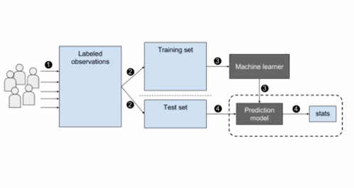

Proceso ML supervisado

1.- Tener observaciones etiquetadas de los datos que vamos a tener
2.-  Set de  entrenamiento y set de validación
3.- Modelo Machine Learner (modelo RL)
4.- Evaluación estadística del modelo.

Una vez se entrene el modelo  podremos predecir datos futuros o pasados fuera del dataset.

Usos de la regresión:

- Estimar crecimiento de la probación
- Predicción del clima
- Predicción del mercado

Uso de Clasificación:

- Retención de clientes
- Diagnósticos
- Clasificación de imágenes

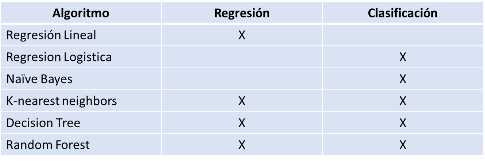

### Clase 3 Explicacion Matematica de la Regresion Lineal

Tenemos dos ejemplos de basicamente el primero es para una regresion lineal con una **pendiente positiva** (los valores de "Y" incrementan al incrementar los valores de "X") y el segundo con una **pendiente Negativa** (los valores de "Y" decrementan al incrementar los valores de "X").

Para ambos casos haremos uso dela ecuacion de regresion lineal 

$Y = b_0 + b_1X$

donde

$Y = $ Variable dependiente (depende de X)
$b_0$ = Constante de proporcionalidad 
$b_1$ = Pendiente de la recta
$X$ = Variable independiente

**Ejemplo 1 Pendiente Positiva**.

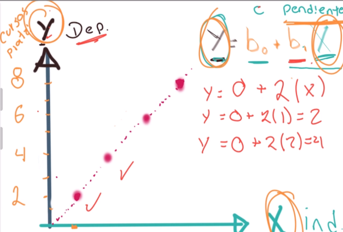

**Ejemplo 2 Pendiente Negativa**.

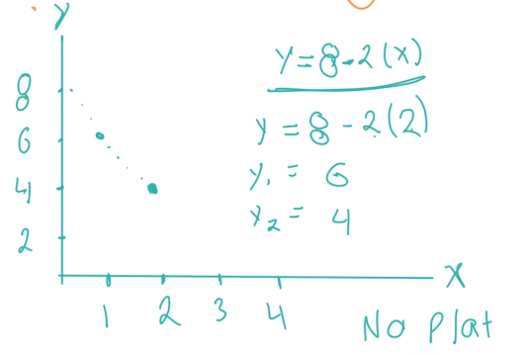

## Modulo 3 Entendiendo el algoritmo de regresión lineal

### Clase 4 Método de Minimos Cuadrados: Ecuacion

A partir de la siguiente tribulación graficamos los puntos en la tabla. Aplicaremos la formula de minimos cuadrados para cada uno de los componentes de $b_1$

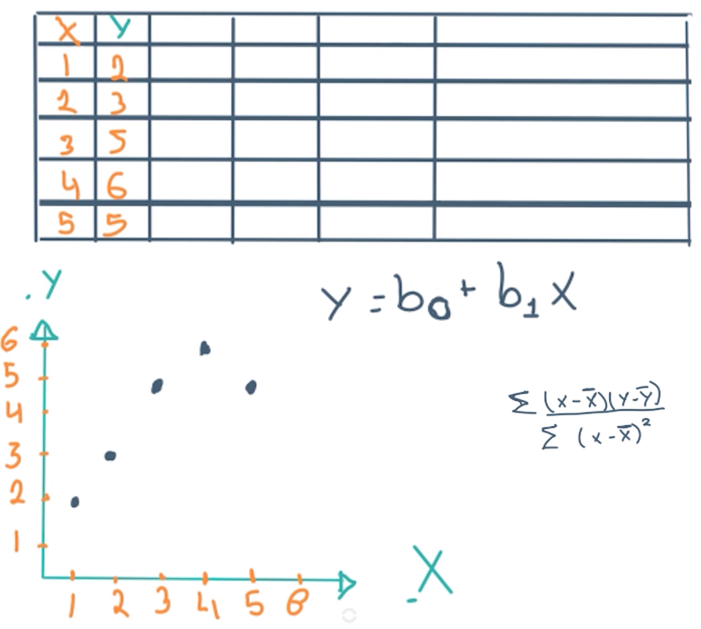

Solución.

### Clase 5 Metodo de Mínimos Cuadrados: Despejando la Ecuacion

Dados los datos de la tabla calculamos entonces $b_1$

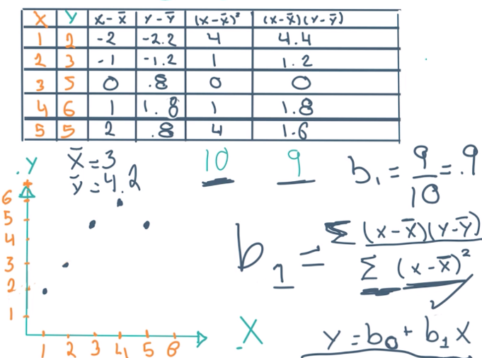

Usando los valores promedio $\bar{x}$ y $\bar{y}$ graficandolos en un plano.

 $\bar{y} = 4.2$  nos permite calcular la constante de proporcionalidad $b0$ de la siguiente manera.
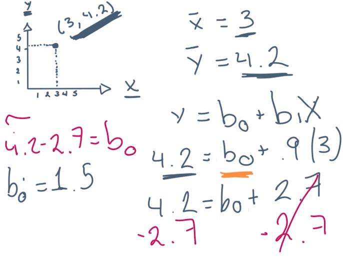

### Clase 6 Generando Predicciones en Papel

A partir e la ecuacion $Y = b_0 + b_1X$ calcularemos valores fuera del set de datos original, calculamos los valores para $x = 6$

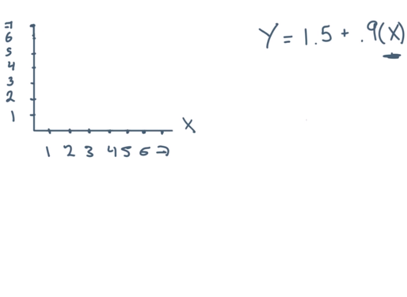

Calculamos, y graficamos el punto para obtener la linea de regresion.

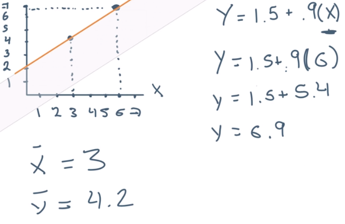

## Modulo 4 Proyecto del curso

### Clase 7 Llevando Nuestro Algoritmo a Python

Creamos un notebook de colab y creamos la funcion para obtener valores de $b_0$ y $b_1$.

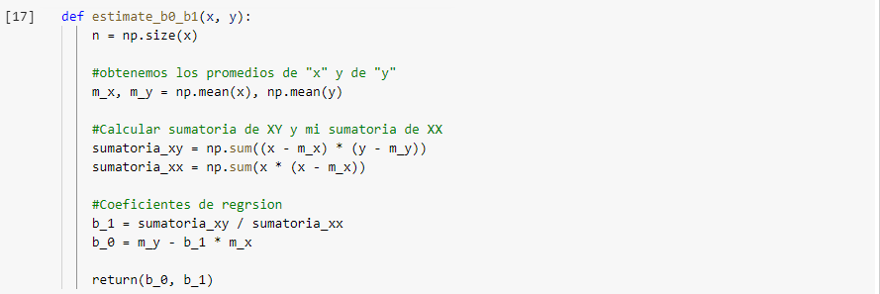

### Clase 8 Creando Nuestra Función de Graficacion

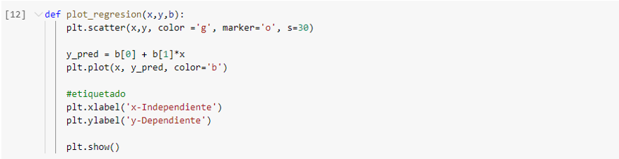

### Clase 9 Codigo Main y Probando Nuestro Codigo

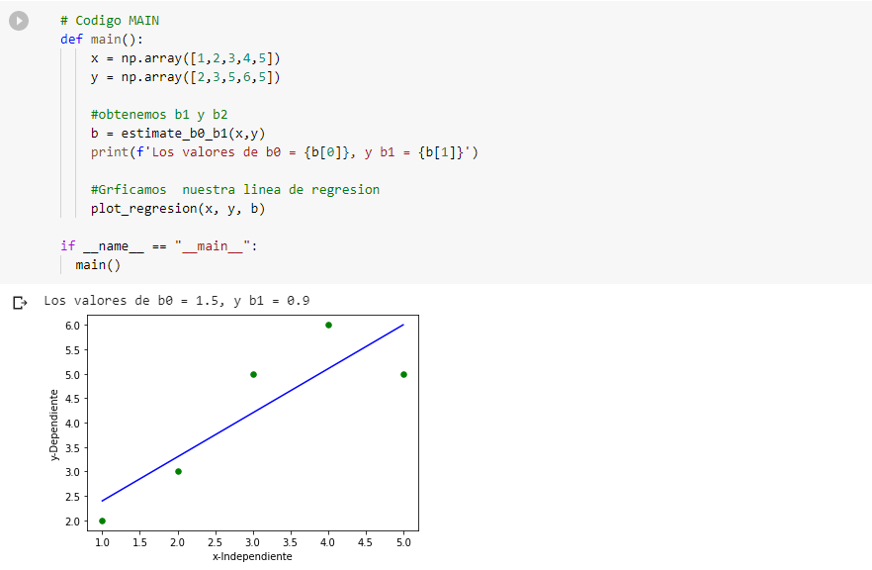